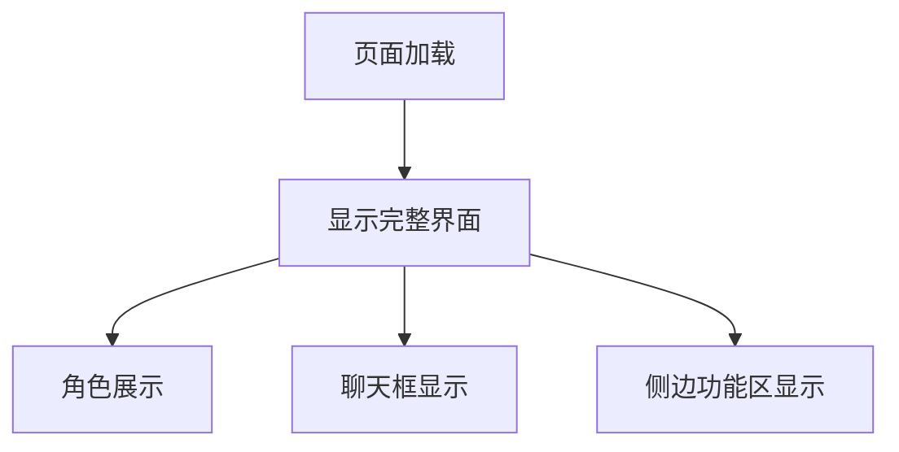

## 1. Product Overview
一个具有沉浸式背景的角色聊天界面页面，采用全屏布局设计，左侧展示角色形象和聊天功能，右侧提供辅助功能区域。

## 2. Core Features

### 2.1 User Roles
无需用户角色区分，这是一个展示性页面。

### 2.2 Feature Module
页面包含以下主要功能区域：
1. **主页面**: 导航栏、角色展示区域、聊天框、侧边功能区

### 2.3 Page Details
| Page Name | Module Name | Feature description |
|-----------|-------------|---------------------|
| 主页面 | 导航栏 | 顶部占位导航栏，提供页面导航功能 |
| 主页面 | 角色展示区域 | 展示角色图片，占据左侧主要空间 |
| 主页面 | 聊天框 | 半透明聊天框，位于页面底部三分之一处 |
| 主页面 | 侧边功能区 | 四个等高的占位div，提供辅助功能空间 |

## 3. Core Process
用户访问页面后即可看到完整的界面布局，无需额外操作。页面采用全屏显示，无需滚动即可查看所有内容。

## 4. User Interface Design

### 4.1 Design Style
- 背景：使用指定背景图片覆盖全屏
- 布局：左右分栏，左3/4右1/4
- 颜色：半透明聊天框，保持背景可见性
- 字体：默认系统字体
- 按钮：简洁现代风格

### 4.2 Page Design Overview
| Page Name | Module Name | UI Elements |
|-----------|-------------|-------------|
| 主页面 | 导航栏 | 顶部横向布局，简洁导航占位 |
| 主页面 | 角色展示 | 左侧主要区域，角色图片居中显示 |
| 主页面 | 聊天框 | 底部三分之一处，半透明背景，圆角边框 |
| 主页面 | 侧边功能区 | 右侧垂直排列四个等高div，简洁占位 |

### 4.3 Responsiveness
采用桌面优先设计，确保在标准浏览器窗口中完整显示，无需滚动条。

### 4.4 3D Scene Guidance
不适用