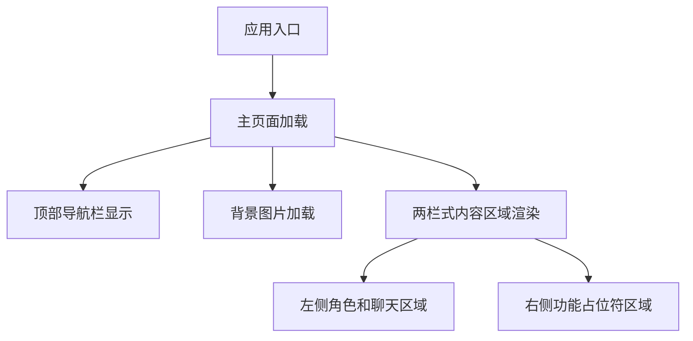

## 1. 产品概述
单页前端应用，采用React和Tailwind CSS构建。页面具有固定背景图片、顶部导航栏，以及两栏式主内容区域（左侧3/4宽度包含角色图片和聊天框，右侧1/4宽度包含4个垂直占位符）。页面为全屏非滚动式设计。

## 2. 核心功能

### 2.2 功能模块
单页应用包含以下核心模块：
1. **主页面**：顶部导航栏、两栏式内容区域（左侧角色展示和聊天功能，右侧功能占位符）

### 2.3 页面详情
| 页面名称 | 模块名称 | 功能描述 |
|---------|---------|----------|
| 主页面 | 顶部导航栏 | 显示应用标题和导航链接，固定定位在页面顶部 |
| 主页面 | 左侧内容区 | 占据3/4宽度，包含角色图片展示区域和聊天交互框 |
| 主页面 | 右侧内容区 | 占据1/4宽度，包含4个垂直排列的功能占位符 |
| 主页面 | 背景图片 | 全屏背景图片，固定定位，不随内容滚动 |

## 3. 核心流程
用户访问应用后直接加载单页面，页面包含固定的顶部导航栏、全屏背景图片，以及两栏式布局的主内容区域。左侧区域展示角色图片和聊天功能，右侧区域提供4个垂直排列的功能入口。

## 4. 用户界面设计

### 4.1 设计风格
- **主色调**：深色背景配合亮色文字，确保良好的视觉对比度
- **按钮样式**：圆角设计，悬停效果，现代化扁平风格
- **字体**：系统默认无衬线字体，标题使用较大字号，正文使用标准字号
- **布局风格**：全屏固定布局，顶部导航+两栏式内容区域
- **图标风格**：使用简洁的线条图标或emoji图标

### 4.2 页面设计概述
| 页面名称 | 模块名称 | UI元素 |
|---------|---------|----------|
| 主页面 | 顶部导航栏 | 固定定位，高度约60px，包含应用logo/标题，导航链接使用水平排列 |
| 主页面 | 背景图片 | 全屏覆盖，使用object-fit: cover，z-index最低层级 |
| 主页面 | 左侧内容区 | 宽度75%，高度calc(100vh - 导航栏高度)，内边距16px，flex布局 |
| 主页面 | 角色图片区域 | 占据左侧区域上半部分，图片自适应容器，圆角边框 |
| 主页面 | 聊天框区域 | 占据左侧区域下半部分，包含消息列表和输入框，底部定位 |
| 主页面 | 右侧内容区 | 宽度25%，高度calc(100vh - 导航栏高度)，内边距16px |
| 主页面 | 功能占位符 | 4个垂直排列的卡片，每个高度约25%，圆角设计，阴影效果 |

### 4.3 响应式设计
采用桌面端优先设计，页面为固定全屏布局，不支持滚动。在移动设备上需要适配屏幕尺寸，但保持基本的布局结构。