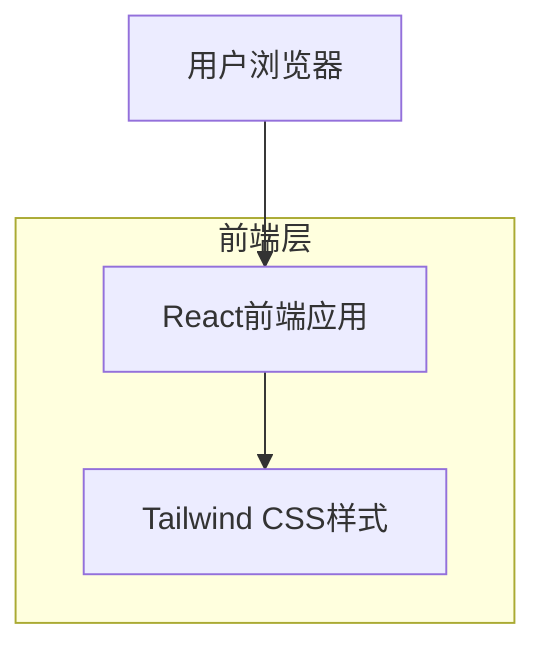

## 1. 架构设计

## 2. 技术描述
- 前端：React@18 + Tailwind CSS@3 + Vite
- 初始化工具：vite-init
- 后端：无（纯前端应用）

## 3. 路由定义
| 路由 | 用途 |
|-------|---------|
| / | 主页面，显示完整的单页应用界面 |

## 4. 组件结构
### 4.1 核心组件
- App：主应用组件，负责整体布局
- Navigation：顶部导航栏组件
- MainContent：主内容区域容器
- LeftPanel：左侧内容区域（3/4宽度）
- RightPanel：右侧内容区域（1/4宽度）
- CharacterDisplay：角色图片展示组件
- ChatBox：聊天交互组件
- PlaceholderCard：功能占位符卡片组件